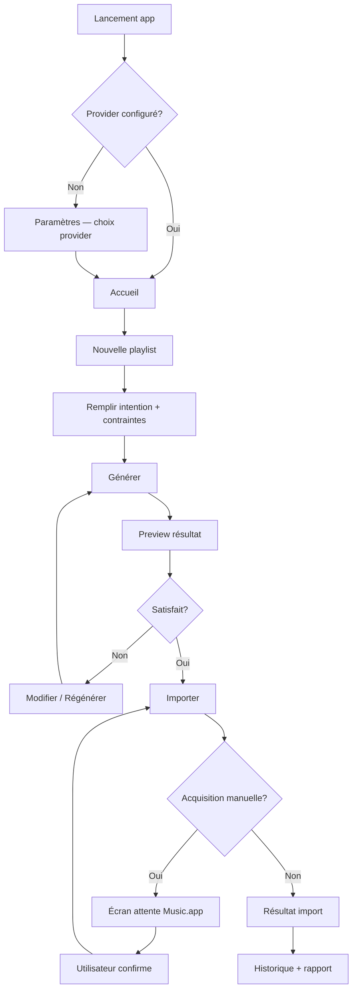

# Phase 4.0 — UX flows

## Navigation model

### Primary destinations

| Route | macOS | iPadOS | iPhone |
|-------|-------|--------|--------|
| Accueil | Sidebar item | Sidebar | Tab 1 |
| Nouvelle playlist | Sidebar + toolbar | Sidebar | Tab 2 (stack) |
| Historique | Sidebar | Sidebar | Tab 3 |
| Diagnostics | Sidebar | Sidebar (advanced) | Settings → Lab |
| Paramètres | Sidebar footer | Sidebar footer | Tab 4 |

### macOS / iPad (regular width)

```text
┌──────────────┬────────────────────────────────────┐
│  Sidebar     │  Detail / Content                  │
│              │                                    │
│  ◉ Accueil   │                                    │
│  ○ Nouvelle  │                                    │
│  ○ Historique│                                    │
│  ○ Lab       │                                    │
│  ─────────   │                                    │
│  ⚙ Réglages  │                                    │
└──────────────┴────────────────────────────────────┘
```

### iPhone (compact width)

```text
┌────────────────────────────────────┐
│  NavigationStack / TabView         │
│  [Accueil] [Créer] [Hist.] [Régl.] │
└────────────────────────────────────┘
```

`AppRoute` enum (shared contract):

```text
home | newPlaylist | preview(id) | import(id) | history | historyDetail(id)
diagnostics | settings | settingsTheme | settingsProvider | manualAcquisition(sessionId)
```

---

## Flow 1 — First launch → première playlist importée



**États UI traversés :** `idle` → `editing` → `generating` → `generated` → `importing` → (`waiting_for_manual_acquisition`) → `completed` | `partial_success` | `failed`

---

## Flow 2 — Accueil → relancer dernière session

1. Utilisateur ouvre l’app → **Accueil**
2. Carte « Dernière session » affiche nom, provider, statut, date
3. Actions : **Rouvrir preview** | **Réimporter** | **Voir rapport**
4. Raccourcis : Nouvelle playlist, Ouvrir historique, Statut provider

---

## Flow 3 — Nouvelle playlist (composition)

### Steps (wizard ou single scroll — recommandation : **single scroll avec ancres**)

| Section | Champs | Validation |
|---------|--------|------------|
| Identité | nom, description | nom requis, 1–120 car. |
| Provider | sélecteur | au moins un disponible |
| Graines | artiste, morceau, poids | ≥ 1 seed OU mots-clés |
| Ambiance | thème playlist, mots-clés, langue | optionnel |
| Taille | nb morceaux OU durée cible | l’un des deux |
| Énergie | profil + courbe preview | enum valide |
| Exclusions | liste structurée | kinds supportés |
| Génération | CTA principal | — |

**Micro-copy pendant génération :**

```text
⚗ Composition en cours…
Analyse des graines · Recherche catalogue · Scoring · Assemblage des sections
```

---

## Flow 4 — Preview / Résultat

1. Sections repliables avec compteur morceaux
2. Chaque ligne : artiste, titre, score, badge confiance, source
3. Actions barre : **Modifier**, **Régénérer**, **Exporter JSON**, **Importer**
4. Tap ligne → détail (raisons scoring, candidats alternatifs — mode simple vs architecte)

---

## Flow 5 — Import

### Progress model (non bloquant)

```text
┌─────────────────────────────────────────┐
│  Import — Orlando Pool Party 2026       │
│  ████████████░░░░░░░░  12/20            │
│                                         │
│  ✅ Kygo — Firestone        cache hit   │
│  📥 Kyo — Dernière danse    acquisition │
│  ⏭ Daft Punk — …           déjà présent │
│  ❌ Artist — Track          non trouvé  │
└─────────────────────────────────────────┘
```

**Événements streamés (Engine Bridge) :**

- `import_started`
- `track_resolving`
- `cache_hit`
- `catalog_acquisition_started`
- `manual_acquisition_required` → navigation `manualAcquisition`
- `track_added` | `track_skipped` | `track_not_found` | `track_error`
- `import_completed`

### Manual acquisition screen

- Instructions claires (3 étapes)
- Bouton « Ouvrir Music.app »
- État : `waiting_for_manual_acquisition`
- CTA : **J’ai ajouté le morceau — Continuer**
- Option : **Ignorer ce morceau** (partial success)

---

## Flow 6 — Diagnostics / Laboratoire

**Deux modes (toggle dans Paramètres → Avancé) :**

| Mode | Contenu |
|------|---------|
| Simple | Résumé pipeline, compteurs, dernier rapport |
| Architecte | Timeline événements, JSON brut, gateway traces, cache stats |

Filtres : session, provider, date, statut.

---

## Flow 7 — Historique

- Liste chronologique des générations / imports
- Filtre : généré seul, importé, échec partiel
- Actions swipe : Relancer, Importer, Comparer (v2), Exporter

---

## Flow 8 — Paramètres

| Section | Options |
|---------|---------|
| Provider | défaut, pays/storefront |
| Apparence | thème, densité (future) |
| Cache | identity, catalogue, vider |
| Import | acquisition auto, attente manuelle |
| Avancé | mode lab, logs, chemins locaux |
| À propos | version engine, licences |

---

## Error & empty states

| Situation | UX |
|-----------|-----|
| Aucun provider | Empty state + CTA paramètres |
| Génération 0 résultat | Explication + assouplir contraintes |
| Import total échec | Rapport détaillé, rien supprimé |
| Engine crash | Redémarrer moteur, conserver brouillon |
| Réseau catalogue down | Retry + mode hors-ligne partiel |

---

## Accessibility flows

- Tab order logique sur tous les champs macOS
- VoiceOver labels sur badges statut (pas couleur seule)
- Dynamic Type sur iOS
- Réduction animations respectée
- Raccourcis clavier : ⌘N nouvelle, ⌘I importer, ⌘L lab

---

## Internationalisation

- Clés `L10n` / `String(localized:)` en Swift
- Python engine messages : codes machine + params ; UI traduit
- FR + EN en v1 UI ; engine logs EN pour dev

## Related

- [phase-4-wireframes.md](phase-4-wireframes.md)
- [phase-4-ui-architecture.md](../architecture/phase-4-ui-architecture.md)
