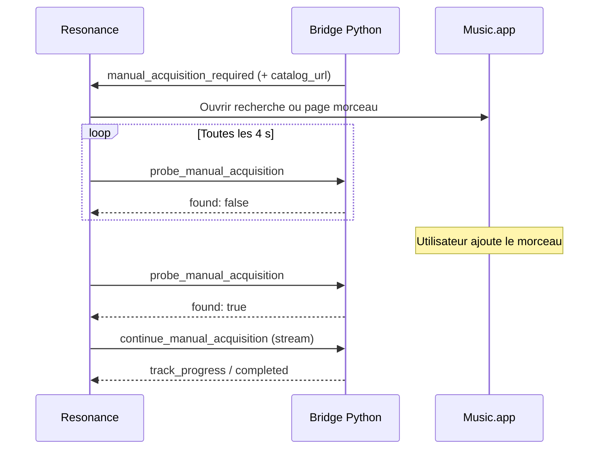

# Phase 5.1.1 — Améliorations UX import Apple Music

Phase de polish UX sur le flux d'import Resonance macOS, sans changer l'architecture fondamentale (Bridge Python, Smart Input, séparation ResonanceCore / ResonanceMac).

## Objectifs

1. Texte sélectionnable et copiable partout où c'est utile
2. Ouverture directe de Music.app avec recherche ou page catalogue préremplie
3. Acquisition manuelle plus fluide (ouverture auto + sonde bibliothèque + reprise auto)
4. Progression morceau par morceau via événements bridge découplés de SwiftUI
5. Rapport final orienté utilisateur avec actions contextuelles
6. Composants SwiftUI factorisés pour les prochaines phases

## Architecture des événements

### Nouvel événement `track_progress`

Émis par `playlist_builder/app/bridge_runtime/import_stream.py` pour chaque étape significative d'un morceau :

| Champ | Description |
|-------|-------------|
| `track_key` | Identifiant stable `index:artist:title` |
| `track_index` | Position 0-based |
| `artist`, `title`, `album`, `section` | Métadonnées affichables |
| `step` | `searching`, `resolving`, `acquiring`, `adding`, `completed` |
| `status` | `ImportTrackStatus` (pending, added, not_found, …) |
| `message` | Libellé utilisateur (« Recherche… », « ✓ Ajouté », …) |
| `catalog_url` | URL catalogue si connue |
| `added_count`, … | Compteurs agrégés en temps réel |

**Côté Swift** : `ImportViewModel` agrège ces événements dans `ImportProgressSnapshot.activities` sans coupler le bridge à la vue. Les vues consomment uniquement le snapshot.

### Commande `probe_manual_acquisition`

Vérifie en lecture seule si le morceau en attente est visible dans la bibliothèque Music.app (`AppleMusicResolver.probe_library_presence`).

- Paramètre : `import_session_id`
- Réponse : `{ found: bool, message: string }`
- Utilisée par `ImportViewModel` toutes les ~4 s pendant l'attente manuelle
- Si `found == true` → reprise automatique via `continue_manual_acquisition`

### `continue_manual_acquisition` en streaming

La reprise après ajout manuel émet désormais les mêmes événements (`started`, `track_progress`, `progress`, …) que `import_playlist`, pour une progression cohérente.

## Composants SwiftUI (ResonanceMac)

| Composant | Rôle |
|-----------|------|
| `SelectableText` | Texte natif macOS sélectionnable |
| `CopyableField` | Label + valeur sélectionnable + bouton copier |
| `ImportMetricsRow` | Pastilles Ajoutés / Introuvables / Erreurs |
| `ImportTrackActivityRow` | Ligne de progression live par morceau |
| `ImportOutcomeRow` | Ligne rapport final avec Copier / Ouvrir Music / Détail |
| `ImportSummaryHeader` | Résumé ✓ N importés, ⚠ N actions requises |
| `ManualAcquisitionCard` | Carte acquisition manuelle enrichie |
| `MusicAppLink` | Deep links `music://` recherche ou URL catalogue |

## Workflow acquisition manuelle

## Limitations Music.app

Documentées après investigation du code d'intégration (`applescript_client`, `library_acquisition`) :

| Capacité | Statut |
|----------|--------|
| Ouvrir une URL catalogue (`itms://`, `music://`, `https://`) | ✅ Côté Python lors de l'acquisition ; exposé à l'UI via `catalog_url` |
| Recherche préremplie via `music://music.apple.com/search?term=…` | ✅ `MusicAppLink` côté Swift |
| Ajout automatique à la bibliothèque (abonnement) | ⚠️ AppleScript — peut échouer → statut `opened` |
| Détection bibliothèque sans re-lancer l'acquisition | ✅ `probe_library_presence` (lecture seule) |
| Polling AppleScript pendant que Music.app est au premier plan | ⚠️ Peut être lent ; intervalle 4 s pour limiter la charge |
| Reprise import sans nouveau clic | ✅ Si la sonde détecte le morceau |
| Relancer un seul morceau depuis le rapport | ❌ Hors scope 5.1.1 (nécessite import partiel ciblé) |
| Annuler un import en cours | ❌ Toujours non implémenté |

**Contrainte Apple** : il n'existe pas d'API publique pour forcer l'ajout à la bibliothèque sans interaction utilisateur dans tous les cas. Resonance ouvre Music au bon endroit et surveille la bibliothèque.

## Choix UX

- **Texte sélectionnable** : `.textSelection(.enabled)` via `SelectableText` plutôt que champs AppKit custom (suffisant pour copier morceaux, artistes, messages d'erreur).
- **Rapport** : ton utilisateur (✓ / ⚠ / ✗) plutôt que « laboratoire scientifique ».
- **Progression** : fil d'activités des derniers morceaux plutôt qu'une seule barre.
- **Pas de retry unitaire** au rapport : actions Copier + Ouvrir Music couvrent le besoin immédiat ; retry global reste via nouvelle génération.

## Fichiers clés

- `playlist_builder/ui/bridge/events.py` — `track_progress_event`
- `playlist_builder/app/bridge_runtime/import_stream.py` — émission live
- `playlist_builder/app/bridge_runtime/backend.py` — `probe_manual_acquisition`, stream continue
- `apps/resonance/ResonanceCore/.../ImportModels.swift` — `ImportTrackActivity`
- `apps/resonance/ResonanceMac/.../ImportViewModel.swift` — agrégation + polling
- `apps/resonance/ResonanceMac/.../Components/Import/` — composants réutilisables

## Tests

- Python : `test_probe_manual_acquisition_command`, flux import mocké
- Swift : `ImportViewModelTests`, garde-fous `ManualAcquisitionCard`
