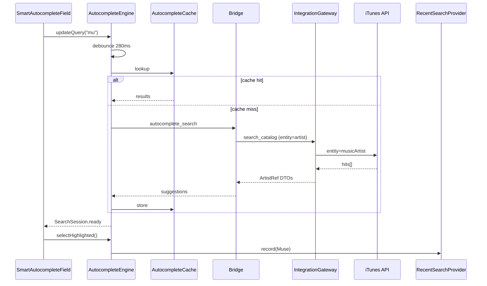

# Smart Input Framework — Phase 5.1

*Architecture et guide d'implémentation — Resonance macOS*

## Vision

Réduire au maximum la saisie libre. L'utilisateur construit sa playlist via **autocomplete**, **suggestions**, **tags** et **recherches récentes** — sans intelligence artificielle ni cloud.

L'expérience cible : **Spotlight**, **Music.app**, **Finder**, **Xcode**.

## Principe architectural

```
SwiftUI (ResonanceMac)
        ↓
Smart Input Framework (ResonanceCore)
        ↓
Autocomplete Service (protocole générique)
        ↓
Bridge JSON-lines
        ↓
Integration Gateway (Python)
        ↓
Provider Gateway (Apple Music, …)
        ↓
Catalogue provider
```

**Règle absolue** : l'UI ne manipule jamais de `String` pour les entités musicales. Elle manipule des **références canoniques** (`ArtistRef`, `TrackRef`, `GenreRef`, `KeywordRef`).

L'UI ne connaît jamais le provider.

## Modèles canoniques

### ArtistRef

| Champ | Type | Usage UI |
|-------|------|----------|
| `id` | `String` | Identité stable (clé canonique) |
| `displayName` | `String` | Libellé affiché |
| `sortName` | `String?` | Tri optionnel |
| `artworkURL` | `URL?` | Vignette résultat |
| `albumCount` | `Int?` | Sous-titre « N albums » |
| `artistType` | `String?` | Band, Solo, … |

### TrackRef

| Champ | Type | Usage UI |
|-------|------|----------|
| `id` | `String` | Identité stable |
| `title` | `String` | Titre |
| `artistName` | `String` | Artiste (affichage) |
| `albumTitle` | `String?` | Album |
| `releaseYear` | `Int?` | Année |
| `durationMs` | `Int?` | Durée formatée |
| `artworkURL` | `URL?` | Vignette |

### GenreRef

| Champ | Type | Usage UI |
|-------|------|----------|
| `id` | `String` | Identifiant canonique |
| `displayName` | `String` | Libellé normalisé |
| `synonyms` | `[String]` | Alias reconnus (Hip Hop → Hip-Hop) |

Le référentiel genre est **local et provider-neutral** (pas d'appel réseau).

### KeywordRef

| Champ | Type | Usage UI |
|-------|------|----------|
| `id` | `String` | Clé normalisée |
| `label` | `String` | Texte du tag |

## Composants du framework (ResonanceCore)

### AutocompleteEngine

Orchestrateur central. Responsabilités :

- Recevoir les changements de requête utilisateur
- **Debounce** configurable (défaut 280 ms)
- **Annuler** les recherches obsolètes (`Task` cancellation)
- Consulter le **cache mémoire** avant tout appel réseau
- Déléguer à un `SuggestionProvider`
- Publier l'état via `SearchSession`

```swift
@MainActor
final class AutocompleteEngine<Entity: CanonicalEntity> {
    func updateQuery(_ query: String)
    func selectHighlighted()
    func moveHighlight(delta: Int)
    func dismiss()
    func recordRecent(_ entity: Entity)
}
```

### SuggestionProvider (protocole)

```swift
protocol SuggestionProvider<Entity> {
    func suggestions(for request: AutocompleteRequest) async throws -> [Entity]
}
```

Implémentations :

| Provider | Entités | Source |
|----------|---------|--------|
| `BridgeSuggestionProvider` | Artist, Track | Bridge → Integration Gateway |
| `LocalGenreSuggestionProvider` | Genre | Référentiel local + synonymes |
| `LocalKeywordSuggestionProvider` | Keyword | Liste curatée + historique |

### RecentSearchProvider

Stockage **local uniquement** (UserDefaults). Aucun cloud.

- Clé par `SmartInputEntityKind` + scope utilisateur
- Max 12 entrées, LRU
- Affiché quand le champ est vide et focalisé

### CanonicalSelection

Encapsule la sélection courante :

```swift
struct CanonicalSelection<Entity> {
    var selected: Entity?
    var query: String          // texte en cours de saisie
    var isEditing: Bool
}
```

Conversion vers `SeedReference` au moment de `buildRequest()` — pas avant.

### SearchSession

État d'une interaction de recherche :

| Propriété | Description |
|-----------|-------------|
| `query` | Texte courant |
| `results` | Suggestions |
| `highlightedIndex` | Index clavier (−1 = aucun) |
| `phase` | `idle` · `debouncing` · `searching` · `ready` · `error` |
| `showsRecents` | Champ vide + focus |
| `recents` | Recherches récentes |

### AutocompleteCache

Cache mémoire thread-safe :

- Clé : `(entityKind, normalizedQuery, contextHash)`
- TTL : 5 minutes (artist/track), illimité (genre/keyword local)
- Taille max : 128 entrées LRU

## Bridge

### Commande `autocomplete_search`

**Requête :**

```json
{
  "id": "…",
  "command": "autocomplete_search",
  "params": {
    "provider_id": "apple_music",
    "entity_kind": "artist",
    "query": "muse",
    "limit": 10,
    "context": {
      "artist_name": "Muse"
    }
  }
}
```

`context.artist_name` priorise les morceaux quand `entity_kind` = `track`.

**Réponse :**

```json
{
  "ok": true,
  "result": {
    "suggestions": [
      {
        "kind": "artist",
        "id": "muse",
        "display_name": "Muse",
        "artwork_url": "https://…",
        "album_count": 12
      }
    ]
  }
}
```

### Protocole Swift `AutocompleteServing`

```swift
public protocol AutocompleteServing: Sendable {
    func search(request: AutocompleteRequest) async throws -> AutocompleteResponse
}
```

Implémenté par `PythonEngineBridgeService` et `MockAutocompleteService`.

## Flux de données

### Artiste



### Morceau (dépendant de l'artiste)

Même flux avec `entity_kind: track` et `context.artist_name` pour le scoring.

### Genre / Mots-clés

Flux **100 % local** — pas de bridge. `LocalGenreSuggestionProvider` et `LocalKeywordSuggestionProvider`.

## Concurrence

| Mécanisme | Usage |
|-----------|-------|
| `Task` + `Task.checkCancellation()` | Annulation requêtes obsolètes |
| `@MainActor` | `AutocompleteEngine`, ViewModels |
| `actor AutocompleteCache` | Cache thread-safe |
| Debounce via `Task.sleep` + remplacement | Évite les rafales |

## Gestion des erreurs

| Situation | Comportement UX |
|-----------|-----------------|
| Bridge indisponible | Message discret, suggestions vides, saisie bloquée pour artist/track |
| Timeout réseau | `phase = .error`, retry au prochain caractère |
| Résultats vides | « Aucun résultat » dans le panneau |
| Provider non supporté | Fallback mock en dev, message en prod |

Pas de message Cocoa brut — messages humanisés via `AutocompleteError`.

## Composants UI (ResonanceMac)

### SmartAutocompleteField\<Entity\>

Champ de recherche macOS avec :

- `AppKitTextField` (clavier fiable Phase 4.8A)
- Panneau résultats (overlay SwiftUI)
- Navigation : ↑ ↓ Enter Escape Tab
- Cmd+Backspace : effacer la sélection
- Recherches récentes au focus sur champ vide

### KeywordTagField

- Tags `[Summer]` `[Relax]` avec ajout/suppression
- Autocomplete inline pour nouveaux tags
- Historique local

## Mapping vers génération

Au commit (`buildRequest()`), les refs sont converties en DTO existants :

```swift
SeedReference(
    artist: seedArtist?.displayName ?? "",
    title: seedTrack?.title ?? ""
)
keywords: selectedKeywords.map(\.label)
```

Aucun changement du contrat `PlaylistGenerationRequest` côté moteur — migration transparente.

## Tests

| Couche | Fichiers | Couverture |
|--------|----------|------------|
| ResonanceCoreTests | `AutocompleteEngineTests`, `AutocompleteCacheTests`, `BridgeClientTests` | debounce, cache TTL, highlight, bridge parsing |
| ResonanceMacTests | `PlaylistBuilderViewModelTests`, `BridgeClientTests` (service) | mapping VM, transport |
| Python | `test_autocomplete_bridge.py`, `test_itunes_multi_search.py` | bridge, mapper, iTunes mock |

## Choix finaux (post-validation macOS)

### Tests & encapsulation

- **`dispatchStreamingLine`** reste `internal` à `BridgeClient` — détail du streaming pendant `send()`. Les tests de parsing utilisent l'API publique **`parseConversation`**. Les tests de callback live sont dans **`ResonanceCoreTests`** via `@testable import ResonanceCore`.
- **`LockedBox`** (`SendableTestCapture.swift`) pour les captures dans les closures `@Sendable` — pas de mutation de variables locales capturées (Swift 6).
- **`AutocompleteEngine.session`** en `private(set)` — les tests appellent `updateQuery` + attente async plutôt que de muter l'état interne.

### Modèles & providers

- **`AutocompleteCache`** : clé d'entité via `String(describing: entity.id)` pour rester générique sur `Identifiable`.
- **`InMemoryRecentSearchProvider`** : `final class` (pas `struct`) car stockage mutable sous `NSLock`.

### Swift Package Manager

```swift
.executableTarget(
    name: "ResonanceMac",
    path: "ResonanceMac",
    exclude: ["Tests", "Resources/Info.plist", "Resources/AppIcon.iconset"],
    sources: ["Sources/ResonanceMac"],
    resources: [.copy("Resources/Assets")]
)
```

`exclude` **avant** `sources` (exigence SPM). Supprime l'avertissement « 27 unhandled files ».

## Évolutions futures (hors 5.1)

- Spotify / Deezer : nouveau `ProviderGateway` + même `SuggestionProvider`
- Apprentissage utilisateur (Phase 6+)
- Genre comme contrainte d'inclusion moteur
- Multi-seed (plusieurs artistes/morceaux)

## Fichiers clés

| Zone | Chemin |
|------|--------|
| Refs canoniques | `ResonanceCore/SmartInput/CanonicalRefs.swift` |
| Moteur | `ResonanceCore/SmartInput/AutocompleteEngine.swift` |
| Bridge Swift | `ResonanceCore/SmartInput/AutocompleteBridgeContracts.swift` |
| UI champ | `ResonanceMac/Components/SmartAutocompleteField.swift` |
| Tags | `ResonanceMac/Components/KeywordTagField.swift` |
| Python DTO | `playlist_builder/ui/shared/dto/autocomplete.py` |
| Use case | `playlist_builder/app/use_cases/autocomplete_search.py` |
| iTunes multi | `playlist_builder/integration/apple_music/itunes_client.py` |
