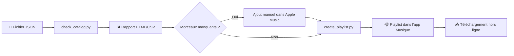

# Workflow complet

*Le parcours de bout en bout — de la définition JSON à la piscine.*

## Vue d'ensemble



## Étape 1 — Définir la playlist (JSON)

Tu écris un fichier JSON qui décrit :
- le **nom** de la playlist ;
- une **description** (optionnelle) ;
- des **sections** ordonnées (Warm Up, Peak, Cool Down…) ;
- des **morceaux** dans chaque section.

→ Détails : [Format JSON](Format-JSON-Playlist)

**Règle d'or** : l'ordre des sections dans le JSON = l'ordre dans Apple Music.

## Étape 2 — Vérifier le catalogue (`check_catalog.py`)

### Ce que fait le script

Pour chaque morceau du JSON :
1. Interroge l'**API iTunes Search** publique (gratuite)
2. Score les résultats (correspondance artiste + titre)
3. Retient la meilleure correspondance si le score est suffisant
4. Écrit un rapport CSV + HTML

### Ce que le script ne fait PAS

- Ne modifie pas Apple Music
- N'ajoute rien à ta bibliothèque
- Ne nécessite pas de compte développeur Apple

### Commande type

```bash
python3 check_catalog.py --country us --playlist playlists/orlando_pool_party_2026.json
```

### Lire le rapport HTML

| Symbole | Signification |
|---------|---------------|
| Lien « ouvrir dans Apple Music » | Correspondance trouvée automatiquement |
| Lien « chercher dans Apple Music » | Pas de match fiable — recherche manuelle |

**Astuce** : commence par les ❌ dans le terminal, puis complète via le HTML.

## Étape 3 — Compléter la bibliothèque (manuel)

AppleScript ne peut ajouter que des morceaux **déjà présents** dans ta bibliothèque Apple Music/iCloud.

Pour chaque morceau manquant :
1. Clique le lien dans le rapport HTML
2. Ajoute le morceau à ta bibliothèque (bouton **+** dans Apple Music)
3. Attends la synchronisation iCloud si besoin

*Comme un dossier sinistre incomplet : on ne peut pas indemniser ce qu'on n'a pas encore enregistré.*

## Étape 4 — Créer la playlist (`create_playlist.py`)

### Mode par défaut (recommandé)

```bash
python3 create_playlist.py
```

Le script :
1. Active l'app **Musique**
2. Crée la playlist si elle n'existe pas
3. Ajoute les morceaux trouvés dans ta bibliothèque
4. **Évite les doublons** par défaut
5. Respecte l'**ordre des sections** du JSON
6. Génère un rapport TXT dans `reports/`

### Codes de sortie

| Code | Signification |
|------|---------------|
| `0` | Succès |
| `1` | Fichier playlist introuvable ou JSON invalide |
| `2` | Configuration MusicKit manquante (moteur musickit uniquement) |
| `3` | Erreur MusicKit |
| `4` | Erreurs partielles lors de l'ajout |

### Symboles dans le terminal

| Symbole | Statut |
|---------|--------|
| ✅ | Morceau ajouté |
| ⏭️ | Déjà présent (ignoré) |
| ❌ | Non trouvé dans la bibliothèque |
| ⚠️ | Erreur technique |

## Étape 5 — Téléchargement hors ligne

1. Ouvre la playlist dans Apple Music
2. Clique sur **Télécharger** (icône nuage)
3. Attends — parfait pour la pool party sans réseau

## Workflow de mise à jour

Tu as modifié le JSON ? Recommence :

```bash
python3 check_catalog.py --country us
# Complète les nouveaux morceaux manquants si besoin
python3 create_playlist.py
```

Les morceaux déjà en playlist sont ignorés (sauf avec `--allow-duplicates`).

## Workflow alternatif — MusicKit (expérimental)

Réservé à quand tu auras un compte Apple Developer payant.

→ [MusicKit expérimental](MusicKit-Experimental)

**Pour l'instant : ignore cette option.** Le workflow AppleScript gratuit fait le job.

---

*Arthur et Léonard approuvent le workflow en 3 étapes. Surtout l'étape « pool party ».*
